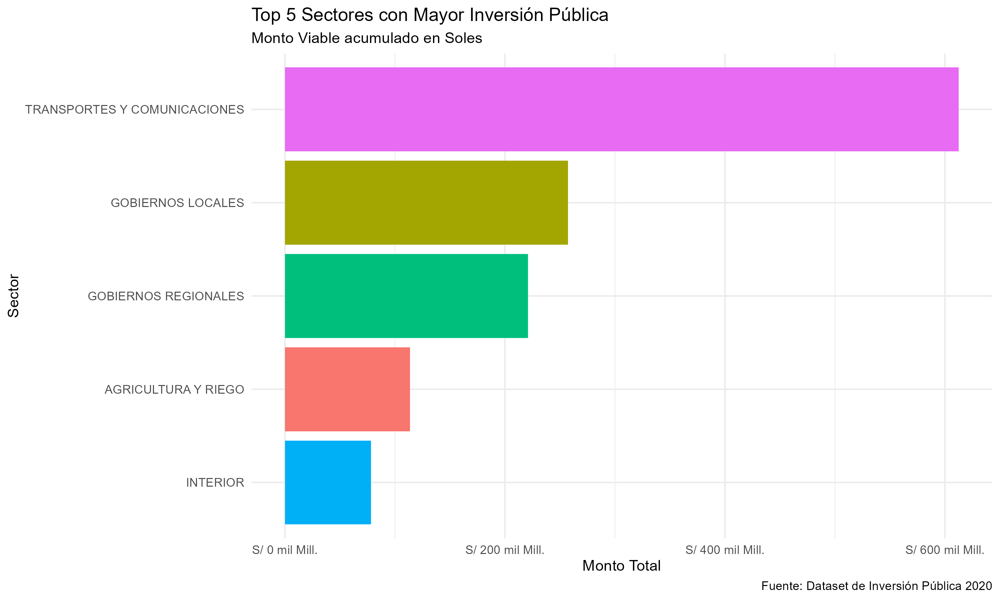
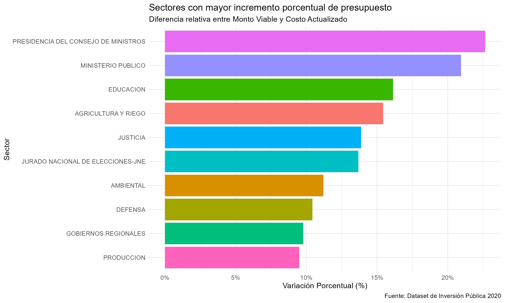
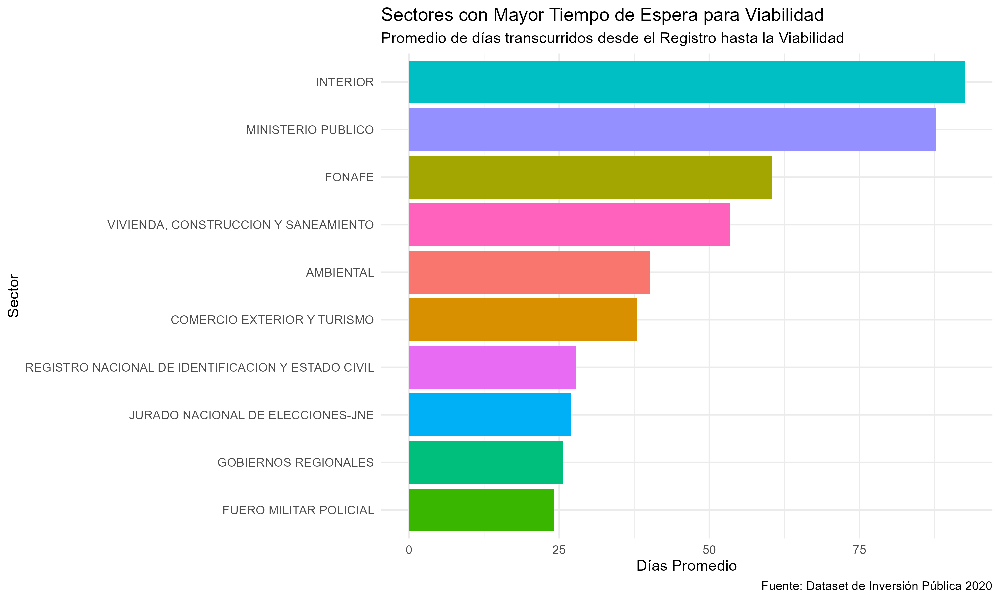
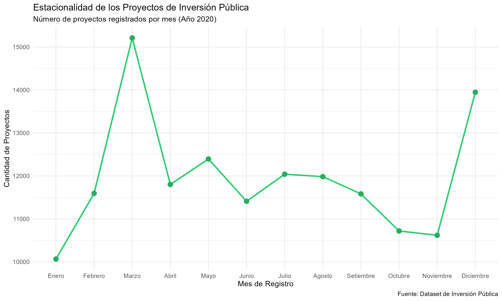
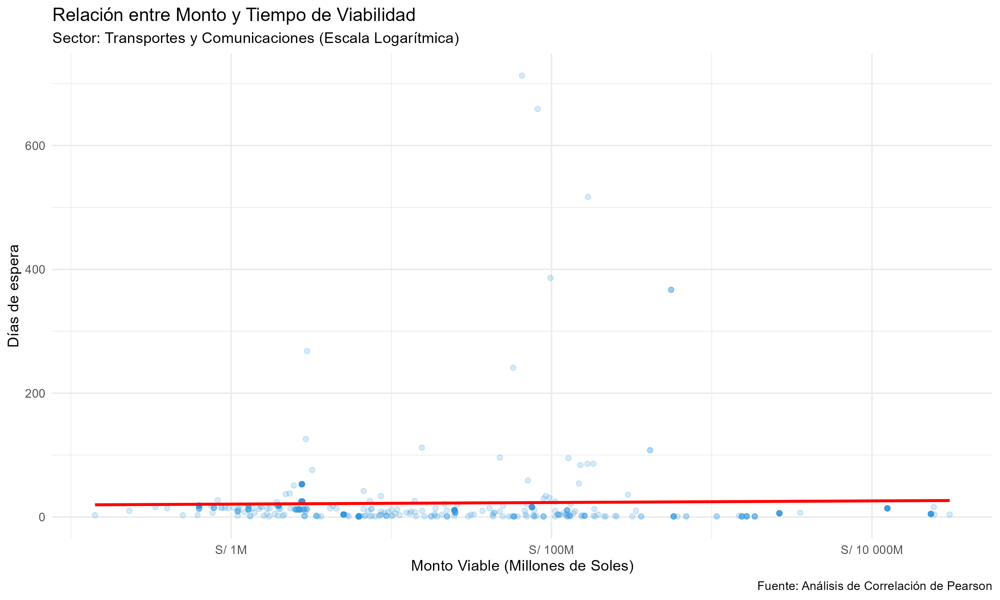

# analisis-inversion-publica-peru
Análisis exploratorio de datos (EDA) sobre la inversión pública en Perú (2020-2024) utilizando R y Tidyverse.

Este proyecto realiza un Análisis Exploratorio de Datos (EDA) sobre la cartera de proyectos de inversión pública en Perú durante el año 2020. El objetivo es diagnosticar la eficiencia sectorial en términos de asignación presupuestaria, desviaciones de costos y agilidad administrativa.

## DATOS
El dataset original se obtuvo de la plataforma de Datos Abiertos del MEF. Debido a su tamaño, no se incluye en este repositorio, pero puede descargarse AQUÍ
https://www.kaggle.com/datasets/jenifergrategarro/dataset-public-investments-in-peru
## 🎯 Preguntas de Negocio Atendidas
Magnitud: ¿Qué sectores concentran la mayor cantidad de recursos financieros?

Precisión: ¿Qué sectores presentan los mayores sobrecostos porcentuales respecto a su planificación inicial?

Eficiencia: ¿Cuánto tiempo (en días) tardan los sectores en declarar viable un proyecto?

Estacionalidad: ¿Existen meses con picos atípicos en el registro de nuevos proyectos?

## 🛠️ Tecnologías Utilizadas
Lenguaje: R v4.x

Librerías principales: * tidyverse (dplyr, ggplot2, readr, tidyr) para manipulación y visualización.

lubridate para el manejo de series temporales.

scales para el formato profesional de etiquetas financieras y porcentuales.

janitor para la limpieza de nombres de variables.

## 📊 Hallazgos Principales
Sector Dominante: El sector Transportes y Comunicaciones lidera la inversión con una brecha significativa, superando los S/ 600 mil millones en monto viable.

Desviación de Costos: Se identificó que la Presidencia del Consejo de Ministros (PCM) y el Ministerio Público tienen las mayores desviaciones, con incrementos de presupuesto superiores al 20%.

Gestión del Tiempo: El sector Interior muestra los tiempos más prolongados para la obtención de viabilidad, promediando ~90 días.

### 📁 Estructura del Repositorio
script_analisis.R: Código fuente completo y documentado.

all_projects_investment_2020_filtered.csv: Dataset procesado.

/resultados_graficos: Carpeta con los 5 reportes visuales exportados automáticamente por el script.

### 🚀 Cómo ejecutarlo
Clona este repositorio.

Asegúrate de tener instaladas las librerías mencionadas.

Abre el archivo .R y ejecuta todas las secciones. El script creará automáticamente el directorio de resultados y exportará los gráficos en alta resolución (300 DPI).

# 📊 Análisis y Resultados Visuales

### 1. Concentración de la Inversión por Sector
El análisis revela que el sector **Transportes y Comunicaciones** lidera la inversión pública en Perú, seguido por los Gobiernos Locales. Esto muestra una priorización de la infraestructura vial y de comunicaciones en la cartera nacional.

---

### 2. Desviación Presupuestaria (%)
Al analizar la variación entre el monto inicial y el costo actualizado, se identificó que sectores como la **PCM** y el **Ministerio Público** presentan los mayores incrementos porcentuales (superiores al 20%), lo que sugiere debilidades en la planificación técnica inicial.

---

### 3. Eficiencia Temporal (Días para Viabilidad)
Existe una disparidad significativa en los tiempos administrativos. Mientras algunos sectores son ágiles, el sector **Interior** promedia cerca de 90 días para declarar viable un proyecto, siendo el punto de mayor demora en el ciclo de inversión.

---

### 4. Análisis de Estacionalidad
El registro de proyectos no es constante; se observan picos de actividad en los meses de [menciona el mes con más proyectos según tu gráfico], lo que refleja la dinámica presupuestal del aparato estatal.

---

### 5. Correlación: Monto vs. Tiempo
Mediante un modelo de regresión, se determinó que el costo del proyecto no siempre dicta el tiempo de su aprobación, sugiriendo que la burocracia depende más de procesos internos que de la magnitud del presupuesto.

